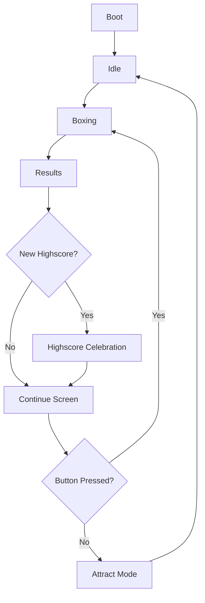

# Flick-Out!! 🥊

[](https://www.arduino.cc/)
[](https://www.espressif.com/)
[](LICENSE)

> A retro-style arcade punching game for the LilyGO T-Display S3, featuring animated GIFs, sound effects, and force-sensitive gameplay.

## 🎮 Features

- 🎬 **Animated GIF Support** - Boot animations, idle loops, and game sequences
- 👊 **Force-Sensitive Gameplay** - Punch strength detection using FSR sensor
- 🔊 **Sound System** - MP3 audio with DFPlayer Mini module
- 🔋 **Battery Monitoring** - Real-time voltage tracking with low battery warnings
- 🏆 **Highscore System** - Persistent storage with reset functionality
- 🎵 **Volume Control** - Adjustable audio levels with visual menu
- ✨ **Attract Modes** - Cycling highscore display and scrolling credits
- ⚡ **Power Management** - Critical battery shutdown protection

## 📋 Hardware Requirements

### Main Components

| Component | Description |
|-----------|-------------|
| **LilyGO T-Display S3** | ESP32-S3 development board with integrated display |
| **DFPlayer Mini** | MP3 module for audio playback |
| **Force Sensitive Resistor (FSR)** | Punch detection sensor |
| **MicroSD Card** | Storage for audio files |
| **LiPo Battery** | Power source with JST connector |

### 🔌 Pin Configuration

```
FSR Sensor:        GPIO 12
Boot Button:       GPIO 0 (built-in)
External Button:   GPIO 17 (with internal pullup)
Battery Monitor:   GPIO 4
DFPlayer RX:       GPIO 21
DFPlayer TX:       GPIO 16
Display Backlight: GPIO 38
Display Power:     GPIO 15
```

## 🛠️ Installation

### Prerequisites

- Arduino IDE 1.8.x or 2.x
- ESP32 Board Package
- Required libraries (see below)

### Required Libraries

Install through Arduino IDE Library Manager:

```
Arduino_GFX_Library     # Display graphics
DFRobotDFPlayerMini    # Audio control
Preferences            # EEPROM storage (built-in)
LittleFS              # Flash file system (built-in)
```

### Steps

1. **Clone the repository**
   ```bash
   git clone https://github.com/yourusername/flick-out.git
   cd flick-out
   ```

2. **Install libraries**
   - Open Arduino IDE
   - Go to `Tools > Manage Libraries`
   - Install the required libraries listed above

3. **Upload the code**
   - Open `flick-out.ino` in Arduino IDE
   - Select board: `ESP32S3 Dev Module`
   - Upload the sketch

4. **Upload GIF files to LittleFS**
   - Install ESP32 Sketch Data Upload tool
   - Place GIF files in `data/` folder
   - Use `Tools > ESP32 Sketch Data Upload`

5. **Prepare SD card**
   - Format microSD card as FAT32
   - Copy MP3 files to root directory
   - Insert into DFPlayer Mini

## 📁 File Structure

### Flash Memory (LittleFS) - GIF Files
```
data/
├── boot.gif         # Boot animation
├── idle.gif         # Idle state animation (loops)
├── start.gif        # Game start animation
├── fight.gif        # Boxing instruction animation
└── highScore.gif    # Highscore attract mode animation
```

### SD Card - Audio Files
```
sdcard/
├── 001.mp3         # Boot music
├── 002.mp3         # Game start sound
├── 003.mp3         # Weak punch sound
├── 004.mp3         # Medium punch sound
├── 005.mp3         # Strong punch sound
├── 008.mp3         # New highscore victory sound
└── 009.mp3         # Score animation sound
```

## 🎯 Game Flow



## 🎮 Controls

| Action | Control |
|--------|---------|
| **Start Game** | Single click any button |
| **Volume Menu** | Double-click any button |
| **Reset Highscore** | Long press (3s) in idle mode |
| **Exit Volume Menu** | Long press (1.5s) in volume menu |
| **Cycle Volume** | Single click in volume menu |

## 🔧 Configuration

### Volume Levels
```cpp
const int VOLUME_LEVELS[] = {0, 1, 5, 10, 15, 20, 25, 30};
```

### Timing Constants
```cpp
const unsigned long CONTINUE_TIMEOUT = 15000;          // Continue screen timeout
const unsigned long IDLE_ATTRACT_DELAY = 10000;        // Time before attract mode
const unsigned long ATTRACT_DISPLAY_DURATION = 15000;  // Attract mode duration
```

### Battery Thresholds
```cpp
#define BATTERY_MAX_VOLTAGE 4.2f        // Full battery
#define BATTERY_MIN_VOLTAGE 3.3f        // Low battery warning
#define BATTERY_CRITICAL_VOLTAGE 3.1f   // Critical shutdown
```

## 🔋 Battery Management

- **Real-time monitoring**: Displays battery percentage indicator
- **Low battery warning**: Visual alert when battery drops below 3.3V
- **Critical shutdown**: Automatic deep sleep at 3.1V to prevent damage
- **Charging support**: Built-in LiPo charging via USB-C

## 🐛 Troubleshooting

<details>
<summary><strong>🔇 No audio output</strong></summary>

- Check SD card is inserted in DFPlayer Mini
- Verify MP3 files are numbered correctly (001.mp3, 002.mp3, etc.)
- Check DFPlayer wiring (RX to GPIO 21, TX to GPIO 16)
- Ensure volume is not set to 0
</details>

<details>
<summary><strong>📺 Display issues</strong></summary>

- Ensure display power pin (GPIO 15) is high
- Check SPI connections to display
- Verify GIF files are uploaded to LittleFS
- Check backlight pin (GPIO 38)
</details>

<details>
<summary><strong>👊 FSR not responding</strong></summary>

- Check FSR connection to GPIO 12
- Ensure FSR has proper pull-up resistor
- Monitor serial output for FSR readings
- Test with different FSR values
</details>

## 📊 Technical Specifications

| Specification | Value |
|---------------|-------|
| **Display** | 170x320 pixel ST7789 TFT |
| **Scoring Range** | 0-999 points |
| **FSR Input Range** | 0-4095 (12-bit ADC) |
| **Audio Formats** | MP3 |
| **Storage** | LittleFS (Flash) + SD Card |
| **Power** | 3.7V LiPo battery |

## 🤝 Contributing

1. Fork the repository
2. Create your feature branch (`git checkout -b feature/amazing-feature`)
3. Commit your changes (`git commit -m 'Add some amazing feature'`)
4. Push to the branch (`git push origin feature/amazing-feature`)
5. Open a Pull Request

## 📄 License

This project is licensed under the MIT License - see the [LICENSE](LICENSE) file for details.

## 🙏 Credits

- **Hardware**: [LilyGO T-Display S3](https://github.com/Xinyuan-LilyGO/T-Display-S3)
- **Music**: Battle Music by Dragon-Studio
- **Development**: Guillaume Loquin (Guybrush)

## 📞 Support

If you encounter any issues or have questions:

- 🐛 [Report bugs](https://github.com/yourusername/flick-out/issues)
- 💡 [Request features](https://github.com/yourusername/flick-out/issues)
- 💬 [Discussions](https://github.com/yourusername/flick-out/discussions)

---

<div align="center">

**Punch your way to the top score! 🥊**

Made with ❤️ by [Guillaume Loquin](https://github.com/yourusername)

</div>